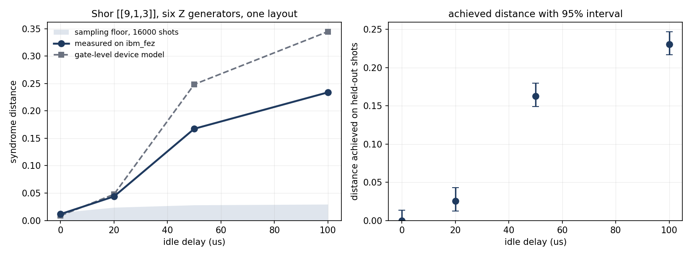

<div align="center">


**Quantum Syndrome and Source Limits**

[](https://www.python.org/)
[](docs/testing.md)
[](pyproject.toml)
[](LICENSE)

</div>

q2sl attest bounds what an observer can learn from the output of a quantum device, in two settings: the
syndrome record of a stabilizer code, and the output of a quantum random number generator. For a stated
code, noise and decoder, or a stated sample and readout calibration, it returns the number. It is written
in Python on numpy, with Qiskit for the circuits, backends and hardware runs.

## Use

| use | entry point | returns |
|---|---|---|
| a code under a noise channel | `q2sl assess <code>`, `expectations.population_leak(code, kraus)` | the total variation distance d between the syndrome records of the logical states 0_L and 1_L; an observer of one record identifies the state with probability (1 + d)/2 |
| the order of d in the noise strength | `zchecks.leak_order(code)` | the leading power, or none for a code whose record does not depend on the state |
| a decoder's output in place of the syndrome | `decoded.decoded_leak(code, kraus)` | d for the correction, its weight and the logical frame bit |
| two measured count records | `estimate.leak_from_counts(c0, c1, n_outcomes)` | a permutation p-value, and the d a likelihood ratio achieves on held-out shots |
| circuits for a device | `hardware.build_extraction_circuits(code, delays)` | Qiskit circuits that prepare 0_L and 1_L, idle, and measure one round of generators |
| a sample of random bits or bytes | `qrng-attest capture <path>`, `estimators.min_entropy(samples)` | the SP 800-90B min-entropy per sample |
| a random number source on a backend | `qrng-attest backend <name>` | a min-entropy bound net of readout error, and the number of uniform bits it yields |

Not provided:

- d for a code past about 14 qubits. At larger sizes the package returns the order and lower bounds, and a
  lower bound near zero does not establish that a record is independent of the state.
- Logical states other than 0_L and 1_L, apart from a search over a grid of 58 states for one round. Mixed
  logical states. A code with several logical qubits is read one logical qubit at a time, in the basis the
  construction picks.
- Correlated noise, crosstalk, and population outside the computational states. Every channel acts on one
  qubit.
- Repeated rounds with measurement error. Many rounds take ideal measurement and a decoder that returns the
  measured syndrome.
- A nonzero d under Pauli noise. It is zero for every Pauli channel, so a Pauli simulation cannot show it.
- Agreement of the gate-level model with a device. On the ibm_fez runs the measured d is 0.6 to 2.1 times
  the model's.
- For sources: a validation under CAVP or CMVP, a bound for a device whose readout calibration is not
  trusted, symbols wider than 8 bits, and the restart tests of SP 800-90B.

Read first:

- [docs/syndromes/concepts.md](docs/syndromes/concepts.md) the quantities and the conventions for bits,
  generators and logical states
- [docs/syndromes/limits.md](docs/syndromes/limits.md) what each model assumes
- [docs/syndromes/engines.md](docs/syndromes/engines.md) which engine returns which quantity, and at what
  size
- [docs/results.md](docs/results.md) every run with its control
- [attest/README.md](attest/README.md) the assessment, the attestation and the certificate
- Shen and Zhong, arXiv:2609.09334, for the observer and the order of the dependence; NIST SP 800-90B for
  the assessment

## Syndromes

Under a Pauli channel the syndrome distribution of a stabilizer code is the same for every encoded logical
state. Under a channel that is not Pauli, such as amplitude damping, it is not, and the syndrome record
carries information about the logical state. `syndrome_leakage` computes that dependence as the total
variation distance between the records of two logical states, for an observer who sees the record and
knows the code, the noise and the decoder, the setting Shen and Zhong study (arXiv:2609.09334). In this
project "leakage" refers to this information, not to population leaving the computational states.

- The distance between the syndrome distributions of two logical states under one single-qubit channel per
  qubit, exactly up to about 14 qubits, for one round with ideal syndrome measurement or a flip rate per
  syndrome bit.
- The order of that distance in the noise strength, by enumeration and by integer programming, for codes
  up to the [[144,12,12]] bivariate bicycle code.
- The L2 distance by tensor network contraction, a lower bound on the leak, for planar codes up to a
  distance 11 surface code.
- Syndrome records sampled under T1 and T2 relaxation at any code size, with lower bounds read from them,
  and the Z-check record exactly up to a distance 5 surface code.
- The likelihood-ratio test on syndrome records, the number of rounds an observer needs with a decoder
  that returns the measured syndrome, and the logical error after recovery.
- The leak through a decoder's output: the correction, its weight, and the logical frame bit over the
  representatives of the logical operator.
- Estimates from measured records, by a permutation test and a likelihood ratio scored on held-out shots.
- Qiskit circuits for any CSS code: |0_L> and |1_L> from the CSS encoder, an idle delay, and one round of
  the selected generators on one ancilla each, with flag qubits as an option; the same round as Stim text
  with detectors; and a gate-level model that runs the transpiled circuits under a backend's calibration.
- Codes loaded from files, qecdb.org, qLDPC and ldpc.

## Sources

A random number generator's output can carry classical detector noise, crosstalk and drift alongside the
entropy of its quantum source. `qrng_attest`, in [attest/](attest/), bounds the min-entropy that output
holds and the number of uniform bits it can yield.

- The NIST SP 800-90B assessment of bits or of symbols up to 8 bits wide: the IID track, the non-IID
  min-entropy estimators, the multi-bit combination and the health tests. The assessment reproduces the
  output NIST publishes for its reference tool on the eleven vectors of its repository to under 1e-9 bits,
  which is not a validation under CAVP or CMVP.
- Device attestation: a min-entropy bound from the device's measured readout calibration, taken as given,
  with the calibration's statistical margin propagated, a worst-pair joint bound for correlated qubits,
  and drift across captures.
- Extraction of uniform bits by a Toeplitz hash under the leftover hash lemma, at a stated epsilon.
- Sources from a Qiskit backend, where a circuit prepares each qubit in |+> and measures it and circuits
  that prepare |0> and |1> on the same qubits give the assignment matrix; from a captured file, a live
  callback or a synthetic model; and the NIST SP 800-22 battery through the optional nistrng package.

## Supporting packages

- `entropy_fusion`: the residual min-entropy of a structured value given the likelihoods of several
  sources, one of which can be a device read, with Shapley values over the sources.
- `reconstruction`: likelihoods from a pattern model, a BP+OSD decoder on a simulated toric code device and
  a seed model fused on one posterior, and the stabilizer Renyi entropy.
- `suite`: a registry over the analyses with SARIF 2.1.0 output, a covert channel read from syndromes, and
  a gate identity check by ZX-calculus.

## Hardware measurement



The Shor [[9,1,3]] code with one round of its six Z generators on IBM `ibm_fez`, job
`daquif6ekp0c73arbd70`, 16000 shots per circuit, every circuit on one layout. The two logical states'
records agree at zero delay and differ at 20, 50 and 100 us, where an observer achieves 0.025, 0.163 and
0.230 on held-out shots, each with p below 0.0005. The dashed line is the gate-level model built from the
calibration read before submission. Full numbers in [docs/results.md](docs/results.md#hardware_shor_pinned).

## Installation

```bash
pip install -e .           # numpy only
pip install -e ".[full]"   # every optional dependency
```

Python 3.11 or newer. The optional dependencies and what uses them are listed in
[docs/installation.md](docs/installation.md).

## Usage

```bash
q2sl assess shor                           # the analyses for one code
q2sl assess file:mycode.npz                # a code from a file
q2sl qecdb n=9 k=1 d=3                     # search qecdb.org for CSS codes
q2sl assess qecdb:674f2504f9caaa7ce7667423
q2sl attest demo                           # entropy attestation of a synthetic source
python -m syndrome_leakage.experiments --save
python -m syndrome_leakage.figures
```

```python
from syndrome_leakage import decoded, expectations as ex, zchecks
from syndrome_leakage.channels import amplitude_damping
from syndrome_leakage.hardware import build_extraction_circuits

code = ex.surface_code_3()
leak, d0, d1 = ex.population_leak(code, amplitude_damping(0.1))
order = zchecks.leak_order(code)["order"]
views = decoded.decoded_leak(code, amplitude_damping(0.1))
circuits, labels = build_extraction_circuits(code, [0.0, 20e-6], checks="z")
```

## Documentation

- [docs/README.md](docs/README.md) the documentation, by topic
- [docs/results.md](docs/results.md) every validation run, with its control
- [CONTRIBUTING.md](CONTRIBUTING.md) the tests and conventions a change is held to
- [SECURITY.md](SECURITY.md) reporting a vulnerability, or a code reported as protected that leaks

## Support

Maintained by Nikolas Klein. Questions and bug reports go to the issue tracker and are answered on a
best-effort basis; security reports follow [SECURITY.md](SECURITY.md).

## Citation

[CITATION.cff](CITATION.cff) gives the citation.

## License

Apache License 2.0, see [LICENSE](LICENSE). Copyright 2026 Nikolas Klein. Third party material and its
licences are listed in [NOTICE](NOTICE). Qiskit is a trademark of International Business Machines
Corporation; this project is not affiliated with or endorsed by IBM.
