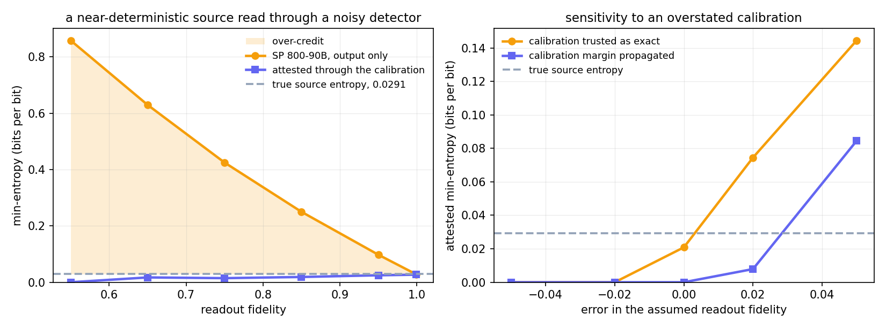
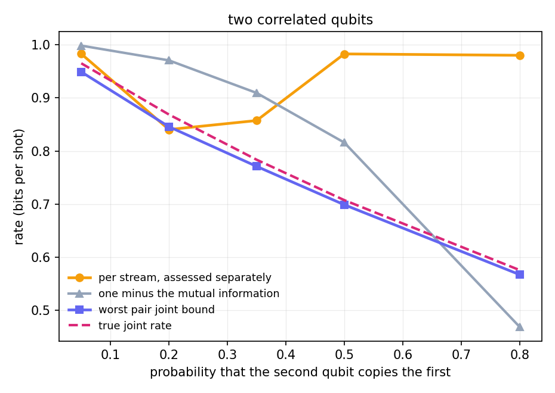

<div align="center">


# qrng-attest

**Entropy assessment and device attestation for quantum random number generation on Qiskit backends**

[](https://www.python.org/)
[](tests/)
[](pyproject.toml)
[](LICENSE)

</div>

qrng-attest measures how much of a quantum RNG's output is entropy from the quantum source and how much
is classical detector noise, crosstalk, or drift. It is also the `attest/` part of q2sl attest
(`NikoKleion/q2sl-Attest`). It runs the NIST SP 800-90B assessment on the bit
stream, attests the result against the device's measured readout calibration, and sizes the extractable
output.

```bash
python -m qrng_attest demo --shots 4000 --qubits 3
```

```
QRNG certificate: demo QRNG  [synthetic]
  4000 shots x 3 qubits
  attested min-entropy = 0.9077 bits/bit   (verdict: PASS)
  classical estimate: IID track (source passed the IID checks)
  extractable = 10766 uniform bits at epsilon = 2^-64
  a 256-bit key costs 421 raw bits
  action: no action required; re-attest after the next calibration cycle
  note: synthetic quantum source: this run is simulated, not measured hardware
```

The demo uses a synthetic source.

## Readout and the SP 800-90B estimate

`python -m qrng_attest.overcredit` runs a source with P(0) = 0.98, which carries 0.0291 bits/bit of
min-entropy, through a symmetric readout of fidelity F. Each observed bit is an independent draw with
`p_obs = F p + (1 - F)(1 - p)`, so the observed stream is Bernoulli-IID.

| readout fidelity | SP 800-90B estimate | attested | estimate minus 0.0291 |
|---|---|---|---|
| 0.55 | 0.8580 | 0.0000 | +0.8289 |
| 0.75 | 0.4247 | 0.0145 | +0.3956 |
| 0.95 | 0.0974 | 0.0247 | +0.0682 |
| 0.999 | 0.0282 | 0.0268 | -0.0010 |

The attested value is at or below 0.0291 in every row. The full table is in [RESULTS.md](RESULTS.md).



The right panel shows the dependence on the calibration. The bound depends on the calibration it is
given. Treating the calibration as exact puts the attested value above 0.0291 as soon as the assumed
fidelity overstates reality. Propagating the calibration's own statistical margin holds the bound at or
below 0.0291 for any error inside that margin.

## Correlated qubits



`python -m qrng_attest.overcredit` also runs two qubits where the second copies the first with probability
c. Both marginals stay uniform and IID, so assessing each stream separately returns close to one bit per
shot at every c, while the true joint rate falls. Debiting the mutual information is a Shannon quantity and
exceeds the true joint rate under moderate crosstalk. The worst pair joint bound is at or below the true
rate at every point, which is the bound the attestation uses.

Figures from `python -m qrng_attest.figures`, which runs the same sweeps that write
`results/overcredit.txt`.

## Checks

The six non-predictor SP 800-90B estimators reproduce NIST's reference tool to under 1e-9 bits on the
official test vectors. The IID track, the attestation, the qubit selection, and the extractor have unit
tests over synthetic data and captured files.

The backend path runs on IBM ibm_marrakesh (2000 shots, two qubits) through qiskit-ibm-runtime with the
SamplerV2 primitive: per-qubit bit order, readout self-calibration from |0> and |1> preparations, result
parsing, and certificate output. Untested on hardware: backends other than ibm_marrakesh, and more than
two qubits per job.

Bit-stream assessment does not depend on the source. A captured file and an in-memory array run the same
path.

## Features

- SP 800-90B assessment: the section 6.3 non-IID estimator suite and the section 5 IID track. The six
  non-predictor estimators reproduce NIST's `ea_non_iid` to under 1e-9 bits on the official `rand1_short`,
  `rand4_short`, and `rand8_short` vectors; on `rand1_short` the four predictors agree to under 0.02,
  and above NIST's values. The assessment is a minimum over the estimators, so dropping the predictors
  can only raise the reported entropy. `certify_source` and `certify_backend` default to
  `include_predictors=False`; `include_predictors=True` gives the bound over the whole suite, which is at
  or below it. Multi-bit sources are
  assessed on both the literal symbols and the bitstring and combined by the reference rule.
- Device attestation: Bloch-vector min-entropy, readout deconvolution through the assignment matrix,
  cross-qubit correlation, drift, and the SP 800-90B health tests. Bounds are one-sided 99 percent
  confidence bounds that include the sampling uncertainty of the data.
- Self-calibration: BackendV2's `Target` does not expose asymmetric readout fidelities, so the package
  measures the assignment matrix from |0> and |1> preparations. The calibration shot count sets the
  uncertainty budget, and the bound is the worst case over that confidence region.
- Qubit selection: reports the subset of qubits that maximizes total bits per shot.
- Randomness extraction: leftover-hash-lemma sizing and a Toeplitz extractor produce uniform output
  bits at the attested rate.
- SP 800-22 battery: with the optional `nistrng` package, `qrng_attest.sp800_22` runs the fifteen NIST
  SP 800-22 rev 1a statistical tests on the bit stream.

## Install

```bash
pip install git+https://github.com/NikoKleion/qrng-attest
```

Not on PyPI. Install from the repository, or from a clone with `pip install -e .`.

Requires Python 3.11+ and numpy. Qiskit is optional and only needed to certify a backend:

```bash
pip install -e ".[qiskit]"    # backend bridge
pip install -e ".[runtime]"   # real IBM hardware (qiskit-ibm-runtime, SamplerV2)
pip install -e ".[aer]"       # local noise-model simulation
pip install -e ".[figures]"   # redraw the figures
pip install -e ".[sp80022]"   # SP 800-22 battery through nistrng
```

File and array assessment requires only numpy.

## Usage

```python
from qrng_attest import certify_backend, extract_from_source, assess

cert = certify_backend(backend, shots=8192)          # run on hardware, self-calibrate, attest
print(cert.rate, cert.passed, cert.key_cost(256))

bits, cert, seed = extract_from_source(source)        # uniform bits, Toeplitz

print(assess("capture.bin", mode="bits", run_iid=True))   # a captured stream, no device
```

Command line:

```bash
python -m qrng_attest demo --qubits 4 --crosstalk 0.5   # synthetic device, flagged
python -m qrng_attest backend manila --simulate         # a Qiskit backend
python -m qrng_attest capture qrng.bin                  # a captured file
```

## Related software and work

- [SP800-90B_EntropyAssessment](https://github.com/usnistgov/SP800-90B_EntropyAssessment), NIST's
  reference implementation of SP 800-90B in C++, and the source of the test vectors used here.
- [hnj2/sp800_90b](https://github.com/hnj2/sp800_90b), Python bindings to NIST's implementation through
  pybind11.
- [dj-on-github/SP800_90b_tests](https://github.com/dj-on-github/SP800_90b_tests), a Python implementation
  of the non-IID tests.
- [qiskit-rng](https://github.com/qiskit-community/qiskit_rng), archived in 2021: randomness bounded by a
  Mermin correlator on a three-qubit GHZ state, with an external extractor service.
- Li et al., Sci. Rep. 11, 23873 (2021): a source-independent QRNG on a cloud quantum computer with
  asymmetric readout error, assessed with SP 800-22 from the vendor's published calibration.
- `qiskit-experiments`, which measures the readout assignment matrix for error mitigation.

The separation of quantum from classical entropy, the handling of readout asymmetry, the leftover hash
lemma sizing and the Toeplitz extractor are published results, cited below.

## Scope

The attestation is semi-device-dependent: it assumes a trusted measurement, a characterized readout, and
trusted hardware. It reimplements the SP 800-90B tests and is checked against NIST's published vectors.
It is not device-independent and is not NIST-certified.

`assess` runs the IID permutation test at a reduced shuffle budget by default, which can deny the IID
credit but never grant it. Pass `--iid-full` or `full=True` for the 10000-shuffle reference budget.
`certify_source` and `certify_backend` use the full budget by default, because a reduced budget fails
clean data on the fixed pass threshold.

## References

- NIST SP 800-90B (2018) and its [reference implementation](https://github.com/usnistgov/SP800-90B_EntropyAssessment):
  the estimators, the IID track and the test vectors.
- Fiorentino et al., Phys. Rev. A 75, 032334 (2007): the Bloch-vector min-entropy bound.
- Li et al., Sci. Rep. 11, 23873 (2021): quantum entropy credited from measured readout error rates.
- Bravyi et al., Phys. Rev. A 103, 042605 (2021): the assignment (calibration) matrix of measurement error
  mitigation.
- Impagliazzo, Levin and Luby, STOC 1989: the leftover hash lemma. Krawczyk, CRYPTO 1994: Toeplitz hashing.
- Frauchiger, Renner and Troyer, arXiv:1311.4547: randomness extraction from realistic quantum devices with
  two-universal hashing.
- NIST SP 800-22 rev 1a (2010): the statistical test suite. Pasqualini,
  [NistRng](https://github.com/InsaneMonster/NistRng) (BSD-3): the implementation `sp800_22` calls.
- Pelofske, arXiv:2307.02573: NIST randomness tests applied to quantum annealer output.

## Hardware scripts

`scripts/` holds the IBM workflow, run from the repository root. `setup_account.py` saves credentials
from a local file, so the token is never typed on a command line. `run_hardware.py` certifies one small
job, with `--dry-run` on a local fake device, which uses no QPU time. `submit_job.py` queues a job and returns, and
`poll_job.py` or `wait_job.py` picks the result up afterward.

## Documentation

- [USAGE.md](USAGE.md) instructions, terms, and the limits of the tool.
- [RESULTS.md](RESULTS.md) the saved runs, with output in `results/`.

## License

Apache 2.0. See [LICENSE](LICENSE).
